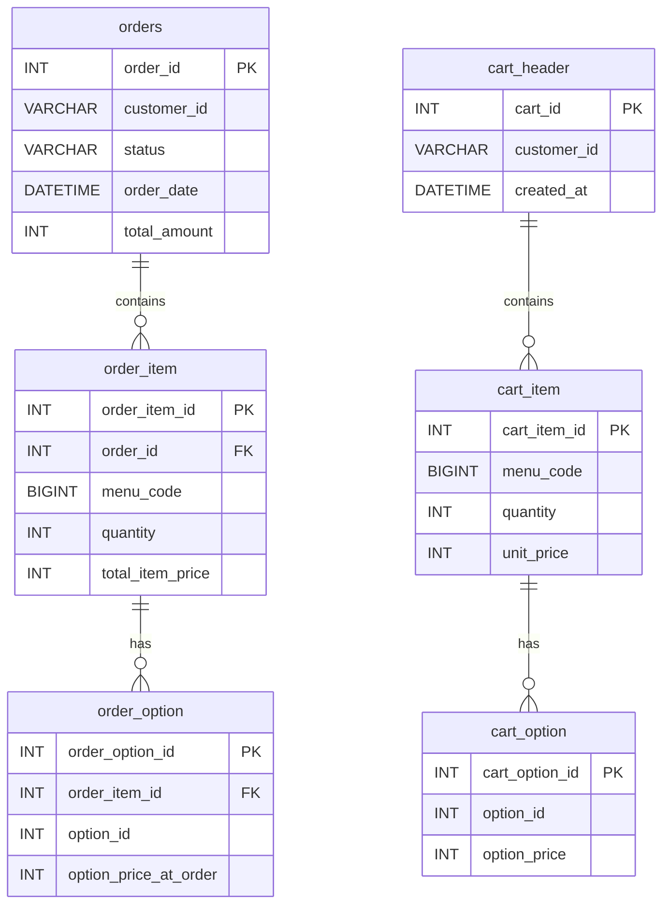
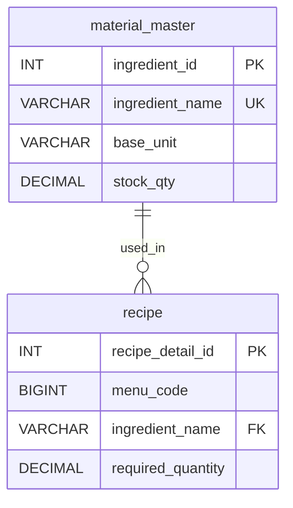
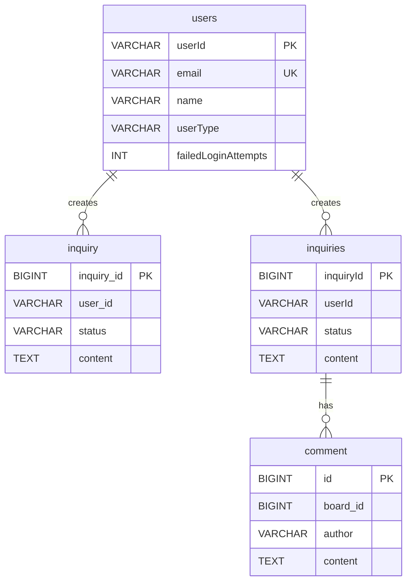

# Database Schema Documentation

## Table of Contents
1. [Overview](#overview)
2. [Database Architecture](#database-architecture)
3. [Schema by Database](#schema-by-database)
   - [member_db](#member_db)
   - [product_db](#product_db)
   - [order_db](#order_db)
   - [inventory_db](#inventory_db)
4. [Entity Relationships](#entity-relationships)
5. [Shared Tables Analysis](#shared-tables-analysis)
6. [Denormalization Patterns](#denormalization-patterns)
7. [Migration Strategy](#migration-strategy)

---

## Overview

This microservices architecture uses **4 separate MySQL databases** distributed across 6 services:

| Database | Port | Services Using It | DDL Auto Mode |
|----------|------|-------------------|---------------|
| member_db | 3306 | member-service, admin-service, board-service | update |
| product_db | 3307 | product-service | update |
| order_db | 3308 | order-service | update |
| inventory_db | 3309 | inventory-service | update |

**Total Entities:** 26 across all services
**Unique Tables:** 19 (accounting for duplicates)

---

## Database Architecture

```mermaid
graph TB
    subgraph "member_db (Port 3306)"
        M1[users]
        M2[inquiry]
        M3[inquiries]
        M4[comment]
        M5[faqs]
        M6[notices]
    end

    subgraph "product_db (Port 3307)"
        P1[menu]
        P2[material_master]
        P3[option_master]
        P4[recipe]
        P5[nutrition]
        P6[allergy]
        P7[menu_option]
    end

    subgraph "order_db (Port 3308)"
        O1[orders]
        O2[order_item]
        O3[order_option]
        O4[cart_header]
        O5[cart_item]
        O6[cart_option]
        O7[material_master]
    end

    subgraph "inventory_db (Port 3309)"
        I1[material_master]
        I2[option_master]
        I3[recipe]
    end

    MS[member-service] --> M1
    AS[admin-service] --> M1
    AS --> M2
    BS[board-service] --> M3
    BS --> M4
    BS --> M5
    BS --> M6

    PS[product-service] --> P1
    PS --> P2
    PS --> P3
    PS --> P4
    PS --> P5
    PS --> P6
    PS --> P7

    OS[order-service] --> O1
    OS --> O2
    OS --> O3
    OS --> O4
    OS --> O5
    OS --> O6
    OS --> O7

    IS[inventory-service] --> I1
    IS --> I2
    IS --> I3
```



---

## Schema by Database

### member_db

**Services:** member-service, admin-service, board-service
**Connection:** `jdbc:mysql://localhost:3306/member_db`
**DDL Mode:** `update`

#### Table: `users`

**Source:** member-service/Member, admin-service/Member
**Primary Key:** Natural Key (userId)
**Purpose:** Central user management table shared across multiple services

| Column Name | Java Type | SQL Type | Constraints | Default | Description |
|-------------|-----------|----------|-------------|---------|-------------|
| userId | String | VARCHAR(50) | PK, NOT NULL | - | User identifier |
| name | String | VARCHAR(100) | NOT NULL | - | User full name |
| email | String | VARCHAR(100) | UNIQUE, NOT NULL | - | User email address |
| password | String | VARCHAR(255) | NOT NULL | - | Encrypted password |
| userType | String | VARCHAR(255) | NOT NULL | "member" | User role type |
| createdAt | LocalDateTime | DATETIME | NOT NULL, updatable=false | CURRENT_TIMESTAMP | Account creation timestamp |
| failedLoginAttempts | Integer | INT | - | 0 | Failed login attempt counter |
| accountLockedUntil | LocalDateTime | DATETIME | - | null | Account lock expiration time |

**Indexes:**
- PRIMARY KEY: userId
- UNIQUE INDEX: email

**Enum: UserType**
- MEMBER
- ADMIN
- STORE_OWNER

**Business Logic:**
- Account locks for 30 minutes after 5 failed login attempts
- Auto-unlock when accountLockedUntil passes current time
- Password is JSON-ignored for security

---

#### Table: `inquiry` (admin-service)

**Source:** admin-service/Inquiry
**Primary Key:** Surrogate Key (inquiry_id)
**Purpose:** Customer inquiry management for admin service

| Column Name | Java Type | SQL Type | Constraints | Default | Description |
|-------------|-----------|----------|-------------|---------|-------------|
| inquiry_id | Long | BIGINT | PK, AUTO_INCREMENT | - | Inquiry identifier |
| title | String | VARCHAR(200) | NOT NULL | - | Inquiry title |
| content | String | TEXT | NOT NULL | - | Inquiry content |
| user_id | String | VARCHAR(50) | NOT NULL | - | User who created inquiry |
| status | String | VARCHAR(20) | NOT NULL | "PENDING" | Inquiry status |
| answer | String | TEXT | - | null | Admin's answer |
| answered_by | String | VARCHAR(50) | - | null | Admin who answered |
| created_at | LocalDateTime | DATETIME | NOT NULL, updatable=false | CURRENT_TIMESTAMP | Creation timestamp |
| answered_at | LocalDateTime | DATETIME | - | null | Answer timestamp |

**Indexes:**
- PRIMARY KEY: inquiry_id

**Status Values:**
- PENDING
- ANSWERED

---

#### Table: `inquiries` (board-service)

**Source:** board-service/Board
**Primary Key:** Surrogate Key (inquiryId)
**Purpose:** Board-service specific inquiry management (duplicate of admin inquiry)

| Column Name | Java Type | SQL Type | Constraints | Default | Description |
|-------------|-----------|----------|-------------|---------|-------------|
| inquiryId | Long | BIGINT | PK, AUTO_INCREMENT | - | Inquiry identifier |
| userId | String | VARCHAR(50) | NOT NULL | - | User who created inquiry |
| title | String | VARCHAR(100) | NOT NULL | - | Inquiry title |
| content | String | TEXT | NOT NULL | - | Inquiry content |
| status | String | VARCHAR(20) | NOT NULL | "pending" | Inquiry status |
| answer | String | TEXT | - | null | Admin's answer |
| answeredBy | String | VARCHAR(50) | - | null | Admin who answered |
| answeredAt | LocalDateTime | DATETIME | - | null | Answer timestamp |
| createdAt | LocalDateTime | DATETIME | - | CURRENT_TIMESTAMP | Creation timestamp |

**Indexes:**
- PRIMARY KEY: inquiryId

**Enum: Status**
- PENDING
- ANSWERED

---

#### Table: `comment`

**Source:** board-service/Comment
**Primary Key:** Surrogate Key (id)
**Purpose:** Comments on board inquiries

| Column Name | Java Type | SQL Type | Constraints | Default | Description |
|-------------|-----------|----------|-------------|---------|-------------|
| id | Long | BIGINT | PK, AUTO_INCREMENT | - | Comment identifier |
| board_id | Long | BIGINT | NOT NULL | - | Referenced board/inquiry ID |
| content | String | VARCHAR(1000) | NOT NULL | - | Comment content |
| author | String | VARCHAR(255) | NOT NULL | - | Comment author (userId) |
| created_at | LocalDateTime | DATETIME | - | CURRENT_TIMESTAMP | Creation timestamp |

**Indexes:**
- PRIMARY KEY: id

**Relationships:**
- board_id references inquiries(inquiryId) - logical FK, not enforced by JPA

---

#### Table: `faqs`

**Source:** board-service/FAQ
**Primary Key:** Surrogate Key (faqId)
**Purpose:** Frequently Asked Questions management

| Column Name | Java Type | SQL Type | Constraints | Default | Description |
|-------------|-----------|----------|-------------|---------|-------------|
| faqId | Long | BIGINT | PK, AUTO_INCREMENT | - | FAQ identifier |
| category | String | VARCHAR(50) | NOT NULL | - | FAQ category |
| question | String | TEXT | NOT NULL | - | FAQ question |
| answer | String | TEXT | NOT NULL | - | FAQ answer |
| viewCount | Integer | INT | NOT NULL | 0 | View counter |
| createdAt | LocalDateTime | DATETIME | - | CURRENT_TIMESTAMP | Creation timestamp |

**Indexes:**
- PRIMARY KEY: faqId

---

#### Table: `notices`

**Source:** board-service/Notice
**Primary Key:** Surrogate Key (noticeId)
**Purpose:** System notices management

| Column Name | Java Type | SQL Type | Constraints | Default | Description |
|-------------|-----------|----------|-------------|---------|-------------|
| noticeId | Long | BIGINT | PK, AUTO_INCREMENT | - | Notice identifier |
| title | String | VARCHAR(200) | NOT NULL | - | Notice title |
| content | String | TEXT | NOT NULL | - | Notice content |
| author | String | VARCHAR(50) | NOT NULL | - | Notice author (admin) |
| isPinned | Boolean | TINYINT(1) | NOT NULL | false | Pin to top flag |
| viewCount | Integer | INT | NOT NULL | 0 | View counter |
| createdAt | LocalDateTime | DATETIME | - | CURRENT_TIMESTAMP | Creation timestamp |

**Indexes:**
- PRIMARY KEY: noticeId

---

### product_db

**Service:** product-service
**Connection:** `jdbc:mysql://localhost:3307/product_db`
**DDL Mode:** `update`
**Init Mode:** `always` (SQL initialization enabled)

#### Table: `menu`

**Source:** product-service/Menu, admin-service/Product
**Primary Key:** Surrogate Key (menu_code)
**Purpose:** Menu/Product catalog

| Column Name | Java Type | SQL Type | Constraints | Default | Description |
|-------------|-----------|----------|-------------|---------|-------------|
| menu_code | Long | BIGINT | PK, AUTO_INCREMENT | - | Menu identifier |
| menu_name | String | VARCHAR(255) | NOT NULL, UNIQUE | - | Menu name |
| allergy_ids | String | VARCHAR(255) | - | null | Comma-separated allergy IDs |
| category | String | VARCHAR(255) | - | null | Menu category |
| base_price | BigDecimal | DECIMAL(19,2) | NOT NULL | - | Base price |
| base_volume | String | VARCHAR(255) | - | null | Base volume/size |
| description | String | VARCHAR(255) | - | null | Menu description |
| create_time | Integer | INT | - | null | Creation time in minutes |
| is_available | Boolean | TINYINT(1) | - | null | Availability flag |

**Indexes:**
- PRIMARY KEY: menu_code
- UNIQUE INDEX: menu_name

**Note:** admin-service's Product entity maps to the same table with slightly different columns:
- admin-service uses VARCHAR(10) for menu_code (but it's a Long in product-service)
- admin-service has image_url, created_at fields

---

#### Table: `material_master` (product-service)

**Source:** product-service/MaterialMaster
**Primary Key:** Surrogate Key (ingredient_id)
**Purpose:** Master data for ingredients/materials

| Column Name | Java Type | SQL Type | Constraints | Default | Description |
|-------------|-----------|----------|-------------|---------|-------------|
| ingredient_id | Integer | INT | PK, AUTO_INCREMENT | - | Ingredient identifier |
| ingredient_name | String | VARCHAR(255) | NOT NULL, UNIQUE | - | Ingredient name |
| base_unit | String | VARCHAR(10) | NOT NULL | - | Base unit for stock |
| stock_qty | BigDecimal | DECIMAL(10,2) | - | null | Current stock quantity |

**Indexes:**
- PRIMARY KEY: ingredient_id
- UNIQUE INDEX: ingredient_name

---

#### Table: `option_master` (product-service)

**Source:** product-service/OptionMaster
**Primary Key:** Surrogate Key (option_id)
**Purpose:** Menu option configurations

| Column Name | Java Type | SQL Type | Constraints | Default | Description |
|-------------|-----------|----------|-------------|---------|-------------|
| option_id | Integer | INT | PK, AUTO_INCREMENT | - | Option identifier |
| option_group_name | String | VARCHAR(255) | NOT NULL | - | Option group name |
| option_name | String | VARCHAR(255) | NOT NULL | - | Option name |
| default_price | BigDecimal | DECIMAL(19,2) | NOT NULL | - | Default price |
| from_material_id | Integer | INT | FK | null | Source material |
| to_material_id | Integer | INT | FK | null | Target material |
| quantity | Double | DOUBLE | NOT NULL | - | Quantity needed |
| unit | String | VARCHAR(255) | NOT NULL | - | Unit of measurement |
| process_method | String (Enum) | VARCHAR(255) | NOT NULL | - | Processing method |

**Indexes:**
- PRIMARY KEY: option_id

**Foreign Keys:**
- from_material_id → material_master(ingredient_id) [LAZY]
- to_material_id → material_master(ingredient_id) [LAZY]

**Enum: ProcessMethod**
- 추가 (Add)
- 제거 (Remove)
- 변경 (Change)

---

#### Table: `recipe` (product-service)

**Source:** product-service/Recipe
**Primary Key:** Surrogate Key (recipe_detail_id)
**Purpose:** Menu recipes with ingredient requirements

| Column Name | Java Type | SQL Type | Constraints | Default | Description |
|-------------|-----------|----------|-------------|---------|-------------|
| recipe_detail_id | Integer | INT | PK, AUTO_INCREMENT | - | Recipe detail identifier |
| menu_code | Long | BIGINT | FK, NOT NULL | - | Menu reference |
| ingredient_id | Integer | INT | FK, NOT NULL | - | Ingredient reference |
| required_quantity | BigDecimal | DECIMAL(8,2) | NOT NULL | - | Required quantity |
| unit | String | VARCHAR(255) | NOT NULL | - | Unit of measurement |

**Indexes:**
- PRIMARY KEY: recipe_detail_id

**Foreign Keys:**
- menu_code → menu(menu_code) [LAZY]
- ingredient_id → material_master(ingredient_id) [LAZY]

**Relationships:**
- Recipe (N) ↔ Menu (1) - @ManyToOne
- Recipe (N) ↔ MaterialMaster (1) - @ManyToOne

---

#### Table: `nutrition`

**Source:** product-service/Nutrition
**Primary Key:** Surrogate Key (menu_code) - shared with menu
**Purpose:** Nutritional information for menu items

| Column Name | Java Type | SQL Type | Constraints | Default | Description |
|-------------|-----------|----------|-------------|---------|-------------|
| menu_code | Long | BIGINT | PK, FK | - | Menu reference |
| calories | BigDecimal | DECIMAL(19,2) | - | null | Calories |
| sodium | BigDecimal | DECIMAL(19,2) | - | null | Sodium content |
| carbs | BigDecimal | DECIMAL(19,2) | - | null | Carbohydrates |
| sugars | BigDecimal | DECIMAL(19,2) | - | null | Sugar content |
| protein | BigDecimal | DECIMAL(19,2) | - | null | Protein content |
| fat | BigDecimal | DECIMAL(19,2) | - | null | Fat content |
| saturated_fat | BigDecimal | DECIMAL(19,2) | - | null | Saturated fat |
| caffeine | BigDecimal | DECIMAL(19,2) | - | null | Caffeine content |

**Indexes:**
- PRIMARY KEY: menu_code

**Foreign Keys:**
- menu_code → menu(menu_code) [LAZY, @MapsId]

**Relationships:**
- Nutrition (1) ↔ Menu (1) - @OneToOne

---

#### Table: `allergy`

**Source:** product-service/Allergy
**Primary Key:** Surrogate Key (allergy_id)
**Purpose:** Allergy information catalog

| Column Name | Java Type | SQL Type | Constraints | Default | Description |
|-------------|-----------|----------|-------------|---------|-------------|
| allergy_id | Integer | INT | PK, AUTO_INCREMENT | - | Allergy identifier |
| allergy_name | String | VARCHAR(255) | - | null | Allergy name |

**Indexes:**
- PRIMARY KEY: allergy_id

**Note:** Referenced by menu.allergy_ids as comma-separated values (denormalized)

---

#### Table: `menu_option`

**Source:** product-service/MenuOption
**Primary Key:** Surrogate Key (id)
**Purpose:** Junction table for menu and option groups

| Column Name | Java Type | SQL Type | Constraints | Default | Description |
|-------------|-----------|----------|-------------|---------|-------------|
| id | Long | BIGINT | PK, AUTO_INCREMENT | - | Menu option identifier |
| menu_code | Long | BIGINT | FK, NOT NULL | - | Menu reference |
| option_group_name | String | VARCHAR(255) | NOT NULL | - | Option group name |

**Indexes:**
- PRIMARY KEY: id

**Foreign Keys:**
- menu_code → menu(menu_code) [LAZY]

**Relationships:**
- MenuOption (N) ↔ Menu (1) - @ManyToOne

---

### order_db

**Service:** order-service
**Connection:** `jdbc:mysql://localhost:3308/order_db`
**DDL Mode:** `update`

#### Table: `orders`

**Source:** order-service/Orders
**Primary Key:** Surrogate Key (order_id)
**Purpose:** Customer orders header

| Column Name | Java Type | SQL Type | Constraints | Default | Description |
|-------------|-----------|----------|-------------|---------|-------------|
| order_id | Integer | INT | PK, AUTO_INCREMENT | - | Order identifier |
| order_date | LocalDateTime | DATETIME | NOT NULL | - | Order creation date |
| total_amount | Integer | INT | NOT NULL | - | Total order amount |
| customer_id | String | VARCHAR(255) | - | null | Customer identifier |
| customer_name | String | VARCHAR(255) | - | null | Customer name |
| status | OrderStatus (Enum) | VARCHAR(20) | - | null | Order status |
| request | String | VARCHAR(255) | - | null | Special requests |

**Indexes:**
- PRIMARY KEY: order_id

**Enum: OrderStatus**
- PENDING ("결제 완료")
- PREPARING ("주문 접수")
- COMPLETED ("주문 완료")
- CANCELED ("주문 취소")

**Relationships:**
- Orders (1) ↔ OrderItem (N) - @OneToMany, bidirectional

**Cascade:** CascadeType.ALL
**Orphan Removal:** true

---

#### Table: `order_item`

**Source:** order-service/OrderItem
**Primary Key:** Surrogate Key (order_item_id)
**Purpose:** Individual items in an order

| Column Name | Java Type | SQL Type | Constraints | Default | Description |
|-------------|-----------|----------|-------------|---------|-------------|
| order_item_id | Integer | INT | PK, AUTO_INCREMENT | - | Order item identifier |
| order_id | Integer | INT | FK, NOT NULL | - | Order reference |
| menu_code | Long | BIGINT | NOT NULL | - | Menu code (logical FK) |
| menu_name | String | VARCHAR(255) | NOT NULL | - | Menu name snapshot |
| quantity | Integer | INT | NOT NULL | - | Item quantity |
| price_at_order | Integer | INT | NOT NULL | - | Base price at order time |
| total_item_price | Integer | INT | NOT NULL | - | Total price with options |

**Indexes:**
- PRIMARY KEY: order_item_id

**Foreign Keys:**
- order_id → orders(order_id) [LAZY]

**Relationships:**
- OrderItem (N) ↔ Orders (1) - @ManyToOne
- OrderItem (1) ↔ OrderOption (N) - @OneToMany, bidirectional

**Cascade:** CascadeType.ALL
**Orphan Removal:** true
**Fetch Strategy:** LAZY

---

#### Table: `order_option`

**Source:** order-service/OrderOption
**Primary Key:** Surrogate Key (order_option_id)
**Purpose:** Options selected for order items

| Column Name | Java Type | SQL Type | Constraints | Default | Description |
|-------------|-----------|----------|-------------|---------|-------------|
| order_option_id | Integer | INT | PK, AUTO_INCREMENT | - | Order option identifier |
| order_item_id | Integer | INT | FK, NOT NULL | - | Order item reference |
| option_id | Integer | INT | NOT NULL | - | Option ID (logical FK) |
| option_name | String | VARCHAR(255) | NOT NULL | - | Option name snapshot |
| option_price_at_order | Integer | INT | NOT NULL | - | Option price at order time |

**Indexes:**
- PRIMARY KEY: order_option_id

**Foreign Keys:**
- order_item_id → order_item(order_item_id) [LAZY]

**Relationships:**
- OrderOption (N) ↔ OrderItem (1) - @ManyToOne

**Fetch Strategy:** LAZY

---

#### Table: `cart_header`

**Source:** order-service/CartHeader
**Primary Key:** Surrogate Key (cart_id)
**Purpose:** Shopping cart header for customers

| Column Name | Java Type | SQL Type | Constraints | Default | Description |
|-------------|-----------|----------|-------------|---------|-------------|
| cart_id | Integer | INT | PK, AUTO_INCREMENT | - | Cart identifier |
| customer_id | String | VARCHAR(255) | - | null | Customer identifier |
| created_at | LocalDateTime | DATETIME | NOT NULL | - | Cart creation date |

**Indexes:**
- PRIMARY KEY: cart_id

**Relationships:**
- CartHeader (1) ↔ CartItem (N) - @OneToMany, unidirectional

**Cascade:** CascadeType.ALL
**Orphan Removal:** true

**Note:** This is a unidirectional relationship - CartItem does not reference CartHeader

---

#### Table: `cart_item`

**Source:** order-service/CartItem
**Primary Key:** Surrogate Key (cart_item_id)
**Purpose:** Items in shopping cart

| Column Name | Java Type | SQL Type | Constraints | Default | Description |
|-------------|-----------|----------|-------------|---------|-------------|
| cart_item_id | Integer | INT | PK, AUTO_INCREMENT | - | Cart item identifier |
| cart_id | Integer | INT | FK (implied) | - | Cart reference (unidirectional) |
| menu_name | String | VARCHAR(50) | NOT NULL | - | Menu name |
| menu_code | Long | BIGINT | NOT NULL | - | Menu code (logical FK) |
| quantity | Integer | INT | NOT NULL | - | Item quantity |
| unit_price | Integer | INT | NOT NULL | - | Unit price |

**Indexes:**
- PRIMARY KEY: cart_item_id

**Relationships:**
- CartItem (1) ↔ CartOption (N) - @OneToMany, unidirectional

**Cascade:** CascadeType.ALL
**Orphan Removal:** true

**Note:** Unidirectional relationships - CartItem does not reference CartHeader

---

#### Table: `cart_option`

**Source:** order-service/CartOption
**Primary Key:** Surrogate Key (cart_option_id)
**Purpose:** Options selected for cart items

| Column Name | Java Type | SQL Type | Constraints | Default | Description |
|-------------|-----------|----------|-------------|---------|-------------|
| cart_option_id | Integer | INT | PK, AUTO_INCREMENT | - | Cart option identifier |
| cart_item_id | Integer | INT | FK (implied) | - | Cart item reference (unidirectional) |
| option_name | String | VARCHAR(50) | NOT NULL | - | Option name |
| option_id | Integer | INT | NOT NULL | - | Option ID (logical FK) |
| option_price | Integer | INT | NOT NULL | - | Option price |

**Indexes:**
- PRIMARY KEY: cart_option_id

**Note:** Unidirectional relationship - CartOption does not reference CartItem

---

#### Table: `material_master` (order-service)

**Source:** order-service/MaterialMaster
**Primary Key:** Surrogate Key (ingredient_id)
**Purpose:** Duplicated material master data in order database

| Column Name | Java Type | SQL Type | Constraints | Default | Description |
|-------------|-----------|----------|-------------|---------|-------------|
| ingredient_id | Integer | INT | PK, AUTO_INCREMENT | - | Ingredient identifier |
| ingredient_name | String | VARCHAR(100) | NOT NULL, UNIQUE | - | Ingredient name |
| base_unit | String | VARCHAR(10) | NOT NULL | - | Base unit for stock |
| stock_qty | BigDecimal | DECIMAL(10,2) | - | null | Current stock quantity |

**Indexes:**
- PRIMARY KEY: ingredient_id
- UNIQUE INDEX: ingredient_name

**Note:** This is a duplicate of the material_master table found in product_db and inventory_db

---

### inventory_db

**Service:** inventory-service
**Connection:** `jdbc:mysql://localhost:3309/inventory_db`
**DDL Mode:** `update`
**Init Mode:** `always` (SQL initialization enabled)

#### Table: `material_master` (inventory-service)

**Source:** inventory-service/MaterialMaster
**Primary Key:** Surrogate Key (ingredient_id)
**Purpose:** Master data for inventory management

| Column Name | Java Type | SQL Type | Constraints | Default | Description |
|-------------|-----------|----------|-------------|---------|-------------|
| ingredient_id | Integer | INT | PK, AUTO_INCREMENT | - | Ingredient identifier |
| ingredient_name | String | VARCHAR(100) | NOT NULL, UNIQUE | - | Ingredient name |
| base_unit | String | VARCHAR(10) | NOT NULL | - | Base unit for stock |
| stock_qty | BigDecimal | DECIMAL(10,2) | - | null | Current stock quantity |

**Indexes:**
- PRIMARY KEY: ingredient_id
- UNIQUE INDEX: ingredient_name

---

#### Table: `option_master` (inventory-service)

**Source:** inventory-service/OptionMaster
**Primary Key:** Surrogate Key (option_id)
**Purpose:** Option master data for inventory tracking

| Column Name | Java Type | SQL Type | Constraints | Default | Description |
|-------------|-----------|----------|-------------|---------|-------------|
| option_id | Integer | INT | PK, AUTO_INCREMENT | - | Option identifier |
| option_group_name | String | VARCHAR(255) | - | null | Option group name |
| option_name | String | VARCHAR(255) | - | null | Option name |
| default_price | Integer | INT | NOT NULL | - | Default price |
| from_material | String | VARCHAR(255) | - | null | Source material name |
| to_material | String | VARCHAR(255) | - | null | Target material name |
| quantity | BigDecimal | DECIMAL(8,2) | - | null | Quantity needed |
| unit | String | VARCHAR(10) | - | null | Unit of measurement |
| process_method | String | VARCHAR(255) | - | null | Processing method |

**Indexes:**
- PRIMARY KEY: option_id

**Note:** Different from product-service's option_master:
- Uses String for from_material/to_material instead of FK references
- Uses Integer for default_price instead of BigDecimal
- Uses BigDecimal for quantity instead of Double
- process_method is String instead of Enum

---

#### Table: `recipe` (inventory-service)

**Source:** inventory-service/Recipe
**Primary Key:** Surrogate Key (recipe_detail_id)
**Purpose:** Recipe data for inventory calculations

| Column Name | Java Type | SQL Type | Constraints | Default | Description |
|-------------|-----------|----------|-------------|---------|-------------|
| recipe_detail_id | Integer | INT | PK, AUTO_INCREMENT | - | Recipe detail identifier |
| menu_code | Long | BIGINT | NOT NULL | - | Menu code (logical FK) |
| ingredient_name | String | VARCHAR(255) | FK, NOT NULL | - | Ingredient name reference |
| ingredient_category | String | VARCHAR(50) | - | null | Ingredient category |
| required_quantity | BigDecimal | DECIMAL(8,2) | NOT NULL | - | Required quantity |
| unit | String | VARCHAR(10) | NOT NULL | - | Unit of measurement |

**Indexes:**
- PRIMARY KEY: recipe_detail_id

**Foreign Keys:**
- ingredient_name → material_master(ingredient_name) [LAZY]

**Relationships:**
- Recipe (N) ↔ MaterialMaster (1) - @ManyToOne

**Note:** Different from product-service's recipe:
- References ingredient by name instead of ID
- Has additional ingredient_category field
- Does not have FK to menu table

---

## Entity Relationships

### product_db Relationships

```mermaid
erDiagram
    menu ||--o{ recipe : "has"
    menu ||--o| nutrition : "has"
    menu ||--o{ menu_option : "has"
    material_master ||--o{ recipe : "used_in"
    material_master ||--o{ option_master : "from_material"
    material_master ||--o{ option_master : "to_material"

    menu {
        BIGINT menu_code PK
        VARCHAR menu_name UK
        DECIMAL base_price
        VARCHAR category
        BOOLEAN is_available
    }

    recipe {
        INT recipe_detail_id PK
        BIGINT menu_code FK
        INT ingredient_id FK
        DECIMAL required_quantity
    }

    nutrition {
        BIGINT menu_code PK_FK
        DECIMAL calories
        DECIMAL protein
    }

    material_master {
        INT ingredient_id PK
        VARCHAR ingredient_name UK
        VARCHAR base_unit
        DECIMAL stock_qty
    }

    option_master {
        INT option_id PK
        VARCHAR option_name
        DECIMAL default_price
        INT from_material_id FK
        INT to_material_id FK
    }

    menu_option {
        BIGINT id PK
        BIGINT menu_code FK
        VARCHAR option_group_name
    }
```

### order_db Relationships



**Note:** Cart relationships are unidirectional:
- CartHeader → CartItem (no back reference)
- CartItem → CartOption (no back reference)

### inventory_db Relationships



### member_db Relationships



**Note:** FKs to users table are logical references only (not enforced by JPA)

---

## Shared Tables Analysis

### 1. `users` Table (member_db)

**Shared by:**
- member-service (Member entity) - Primary owner
- admin-service (Member entity) - Read/write access

**Differences:**
- Both entities are identical
- Both connect to same database (member_db)
- This is proper table sharing with consistent schema

**Use Case:**
- member-service: User registration, authentication, profile management
- admin-service: User administration, viewing user data

---

### 2. `inquiry` vs `inquiries` Tables (member_db)

**Issue:** Two separate tables for similar purpose

**admin-service/Inquiry → `inquiry` table:**
- Column: inquiry_id (BIGINT)
- Title: VARCHAR(200)
- Status default: "PENDING"
- Has @CreationTimestamp

**board-service/Board → `inquiries` table:**
- Column: inquiryId (BIGINT)
- Title: VARCHAR(100)
- Status default: "pending"
- Has @PrePersist

**Recommendation:** Consolidate into single table

---

### 3. `material_master` Table (Appears in 3 databases)

**Instances:**

1. **product_db** (product-service/MaterialMaster)
   - ingredient_name: VARCHAR(255), NOT NULL, UNIQUE
   - Primary source for menu recipes
   - Has FK relationships with recipe and option_master

2. **inventory_db** (inventory-service/MaterialMaster)
   - ingredient_name: VARCHAR(100), NOT NULL, UNIQUE
   - Primary source for inventory management
   - Has FK relationship with recipe table
   - Used by recipe via ingredient_name (String FK)

3. **order_db** (order-service/MaterialMaster)
   - ingredient_name: VARCHAR(100), NOT NULL, UNIQUE
   - No relationships defined
   - Appears to be a denormalized copy

**Differences:**
- product-service: No length specified for ingredient_name
- inventory/order-service: VARCHAR(100) for ingredient_name
- All have identical column structure otherwise

**Synchronization Challenge:**
- Three independent databases with same data
- No automatic synchronization mechanism
- Potential data inconsistency across services

---

### 4. `option_master` Table (Appears in 2 databases)

**Instances:**

1. **product_db** (product-service/OptionMaster)
   - default_price: BigDecimal (DECIMAL)
   - from_material_id: Integer FK to material_master
   - to_material_id: Integer FK to material_master
   - quantity: Double
   - process_method: Enum (추가, 제거, 변경)

2. **inventory_db** (inventory-service/OptionMaster)
   - default_price: Integer
   - from_material: String (no FK)
   - to_material: String (no FK)
   - quantity: BigDecimal
   - process_method: String

**Major Differences:**
- Data types differ significantly
- product-service uses FKs, inventory-service uses Strings
- Different enum handling

---

### 5. `recipe` Table (Appears in 2 databases)

**Instances:**

1. **product_db** (product-service/Recipe)
   - Has FK to menu(menu_code)
   - Has FK to material_master(ingredient_id)
   - No ingredient_category field

2. **inventory_db** (inventory-service/Recipe)
   - No FK to menu (just menu_code as Long)
   - Has FK to material_master(ingredient_name) - String based
   - Has ingredient_category field

**Differences:**
- Different FK strategies
- Different column sets
- Purpose: product-service for menu recipes, inventory-service for stock calculations

---

## Denormalization Patterns

### 1. Snapshot Pattern (Order Service)

**Purpose:** Preserve historical data at order time

**Implementation:**
- `orders.customer_name` - Copy of user name
- `order_item.menu_name` - Copy of menu name
- `order_item.price_at_order` - Copy of menu base_price
- `order_option.option_name` - Copy of option name
- `order_option.option_price_at_order` - Copy of option price

**Benefit:** Order data remains consistent even if products/prices change

---

### 2. Aggregate Storage Pattern

**Implementation:**
- `menu.allergy_ids` - Comma-separated string instead of junction table
- `order_item.total_item_price` - Calculated total stored
- `orders.total_amount` - Calculated order total stored

**Benefit:** Avoids complex joins for frequently accessed data

---

### 3. Replicated Master Data Pattern

**Tables Replicated:**
- material_master (3 copies across product_db, order_db, inventory_db)
- option_master (2 copies across product_db, inventory_db)
- recipe (2 copies across product_db, inventory_db)

**Challenge:** No built-in synchronization mechanism

**Mitigation Strategies Needed:**
- Event-driven updates via RabbitMQ
- Periodic reconciliation jobs
- Master data service pattern
- API calls to single source of truth

---

## Migration Strategy

### Current Configuration

All services use: `spring.jpa.hibernate.ddl-auto=update`

**Behavior:**
- Automatically creates tables on first run
- Updates schema when entity changes
- Does NOT drop columns or tables
- Can lead to schema drift

### Services with SQL Initialization

**product-service:**
```properties
spring.jpa.defer-datasource-initialization=true
spring.sql.init.mode=always
```

**inventory-service:**
```properties
spring.jpa.defer-datasource-initialization=true
spring.sql.init.mode=always
```

**Purpose:** Load initial data from data.sql after schema creation

---

### Recommendations

#### 1. Development Environment
- Current setup is acceptable
- `ddl-auto=update` provides flexibility

#### 2. Production Environment
**Critical Changes Needed:**
```properties
spring.jpa.hibernate.ddl-auto=validate
spring.sql.init.mode=never
```

**Implement:**
- Flyway or Liquibase for version-controlled migrations
- Manual SQL scripts for schema changes
- Rollback procedures
- Database backup strategy

#### 3. Schema Synchronization Strategy

**For Replicated Tables (material_master, option_master, recipe):**

**Option A: Single Source of Truth**
- Keep master data only in product_db
- Other services access via REST API
- Implement caching in consuming services

**Option B: Event-Driven Synchronization**
- Master data changes publish to RabbitMQ
- Subscriber services update their local copies
- Implement eventual consistency

**Option C: Dedicated Master Data Service**
- Create new microservice for master data
- All services consume via API
- Centralized governance

#### 4. Foreign Key Considerations

**Current State:** Minimal FK constraints in JPA

**Pros:**
- Microservices independence
- No cross-database constraints
- Easier to scale services independently

**Cons:**
- Referential integrity not enforced at DB level
- Application must handle orphaned records
- Data inconsistency risk

**Recommendation:**
- Keep current approach for cross-service references
- Add FK constraints within same database (e.g., orders → order_item)
- Implement compensating transactions for distributed data

---

## Key Findings Summary

### Database Distribution
- 4 separate databases across 6 services
- 1 shared database (member_db) used by 3 services
- 19 unique tables, 26 entity definitions

### Duplicate Tables
1. **material_master** - 3 instances (product_db, order_db, inventory_db)
2. **option_master** - 2 instances (product_db, inventory_db)
3. **recipe** - 2 instances (product_db, inventory_db)
4. **inquiry/inquiries** - 2 separate tables in member_db

### Relationship Patterns
- **Bidirectional:** orders ↔ order_item, order_item ↔ order_option
- **Unidirectional:** cart_header → cart_item → cart_option
- **One-to-One:** menu ↔ nutrition (shared PK)
- **Many-to-One:** recipe → menu, recipe → material_master

### Data Integrity Patterns
- Snapshot pattern in order service (historical accuracy)
- Logical FK references (no DB-level enforcement)
- Enum types for controlled values
- Unique constraints on natural keys (email, ingredient_name, menu_name)

### Primary Key Strategies
- **Natural Keys:** users.userId (varchar), menu.menu_code in admin-service
- **Surrogate Keys:** All other entities (AUTO_INCREMENT)

### Index Coverage
- All PKs auto-indexed
- Unique constraints on: email, ingredient_name, menu_name
- No explicit secondary indexes defined

---

## Appendix: Entity Count by Service

| Service | Entity Count | Tables |
|---------|--------------|--------|
| admin-service | 3 | inquiry, users, menu |
| board-service | 4 | inquiries, comment, faqs, notices |
| inventory-service | 3 | material_master, option_master, recipe |
| member-service | 1 | users |
| order-service | 8 | orders, order_item, order_option, cart_header, cart_item, cart_option, material_master |
| product-service | 7 | menu, material_master, option_master, recipe, nutrition, allergy, menu_option |
| **Total** | **26** | **19 unique** |

---

**Document Version:** 1.0
**Last Updated:** 2026-04-14
**Maintained By:** Development Team